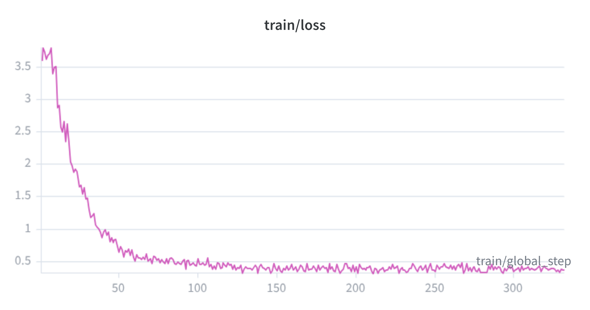

# Fine-tuning a Compact VLM for SlideVQA

Part of a series of weekend projects where I try to build something (anything) over a weekend.

Initially I was like: this is a small VLM, let's see if it can do anything useful on DocVQA. If not, then the plan was to train it and try to make it better.

But then it turned out `LiquidAI/LFM2.5-VL-1.6B` was already pretty good at DocVQA, so the project moved toward a harder multi-slide benchmark: SlideVQA.

---

## Thoughts

Initially I wanted to see how `LiquidAI/LFM2.5-VL-1.6B` performs on basic DocVQA.

I was going to just use VLMEvalKit, but its implementation did not have batching at all, which made eval painfully slow. `lmms-eval` did have batching, but did not support the LFM2.5-VL-1.6B model I wanted to use. So I ended up writing a small standalone batched DocVQA eval script, taking ideas from VLMEvalKit and lmms-eval.

The slightly funny part is that the base model was already very good at DocVQA:

| Model / setting | Benchmark |      Split | Samples |      Metric |
| --------------- | --------- | ---------: | ------: | ----------: |
| LFM2.5-VL-1.6B  | DocVQA    | validation |   5,349 | ANLS 0.8829 |

So DocVQA was not that interesting as an improvement target. I then looked for a harder multi-page / multi-slide benchmark and ended up using SlideVQA.

After running eval on SlideVQA, I saw there was room to improve:

| Model / setting | Benchmark |      Split | Samples |                              Metric |
| --------------- | --------- | ---------: | ------: | ----------------------------------: |
| LFM2.5-VL-1.6B  | SlideVQA  | validation |   1,652 | ANLS 0.4537 / EM 0.3130 / F1 0.3856 |

To cross-check whether this was mostly because the model could not find the right page, I also ran an evidence-pages-only eval, where the model only gets the dataset's gold evidence slides instead of all 20 slides.

| Model / setting                          | Benchmark |      Split | Samples |                              Metric |
| ---------------------------------------- | --------- | ---------: | ------: | ----------------------------------: |
| LFM2.5-VL-1.6B, gold evidence pages only | SlideVQA  | validation |   1,652 | ANLS 0.6487 / EM 0.4691 / F1 0.5434 |

That improved ANLS by about 0.20, so the model can answer much better once it is looking at the right slide(s). The hard part is finding those slides and producing the exact short answer.

Then I used this SFT approach where I tried to teach the model the two things it seemed to be struggling with:

1. given all the slides, find the relevant evidence slide/page numbers
2. given the right evidence slides, produce the short answer in the format the benchmark expects

So each SlideVQA training example was turned into two training records: one for evidence selection and one for answer generation. I used Unsloth + PEFT LoRA for this, and only trained about 9.1M parameters, roughly 0.57% of the 1.6B base model.

LoRA adapter: [`saad1926q/lfm2.5-vl-slidevqa-lora`](https://huggingface.co/saad1926q/lfm2.5-vl-slidevqa-lora)

Training loss looked like this:

After SFT, the standard all-slide eval score was:

| Model / setting                | Benchmark |      Split | Samples |                              Metric |
| ------------------------------ | --------- | ---------: | ------: | ----------------------------------: |
| LFM2.5-VL-1.6B + SlideVQA LoRA | SlideVQA  | validation |   1,652 | ANLS 0.4763 / EM 0.3856 / F1 0.4423 |

Gain over the base all-slide eval: **+0.0226 ANLS**, **+0.0726 EM**, **+0.0567 F1**.

Honestly, I did not get as much improvement as I hoped, which is a bit disappointing. But there were still a lot of new things I liked learning about, especially ANLS, document VQA evals, and how much retrieval/page selection matters.

I also ended up raising a PR to `lmms-eval` to add support for the LFM2.5-VL-1.6B model, so hopefully that gets merged.
